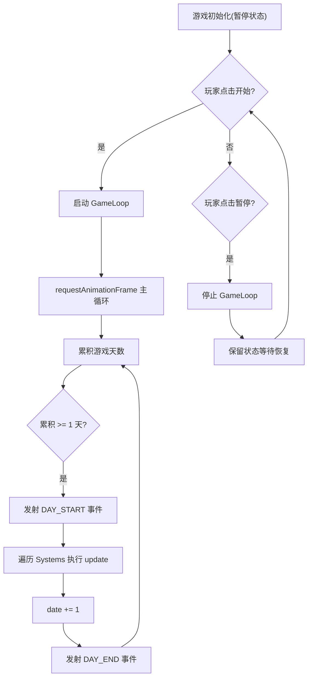

# AI 公司模拟经营游戏 - 产品需求文档 (PRD)

## 1. 产品概述

一款单页面 AI 公司模拟经营游戏，玩家通过管理资金、算力卡、员工和模型来经营一家 AI 公司。游戏时间以"天"为单位推进，玩家可控制暂停、恢复与速度倍率。
- **目标用户**：喜欢模拟经营类游戏、对 AI 产业有兴趣的玩家
- **核心价值**：提供深度经营策略与 AI 产业模拟体验，目前为 MVP 框架阶段

## 2. 核心功能

### 2.1 功能模块
1. **顶部状态栏 (TopBar)**：显示当前游戏日期与公司资金
2. **游戏控制栏 (GameControls)**：暂停/开始、速度调节
3. **主区域占位**：为后续算力卡、员工、模型等模块预留区域

### 2.2 页面详情
| 页面区域 | 模块名称 | 功能描述 |
|---------|---------|---------|
| TopBar | 日期显示 | 显示距起始日期的天数 |
| TopBar | 资金显示 | 显示当前公司资金（美元）|
| GameControls | 暂停/开始按钮 | 切换游戏运行状态 |
| GameControls | 速度选择器 | 调节游戏速度倍率 |

## 3. 核心流程

游戏初始化后处于暂停状态，玩家点击"开始"后游戏循环启动，按速度倍率推进天数；点击"暂停"停止推进；调节速度影响天数推进快慢。

## 4. 用户界面设计

### 4.1 设计风格
- **主色调**：科技感深色主题，搭配青色/绿色高亮（呼应 AI 主题）
- **按钮风格**：扁平化圆角按钮，hover 状态有微反馈
- **字体**：等宽显示字体用于数值，无衬线字体用于文本
- **布局**：顶部固定栏 + 控制栏 + 主内容区

### 4.2 页面设计概览
| 页面区域 | 模块名称 | UI 元素 |
|---------|---------|---------|
| TopBar | 状态栏 | 深色背景、青色高亮数值、固定顶部 |
| GameControls | 控制按钮组 | 按钮间距均匀、激活态高亮 |

### 4.3 响应式
桌面优先设计，MVP 阶段保持简单布局。
