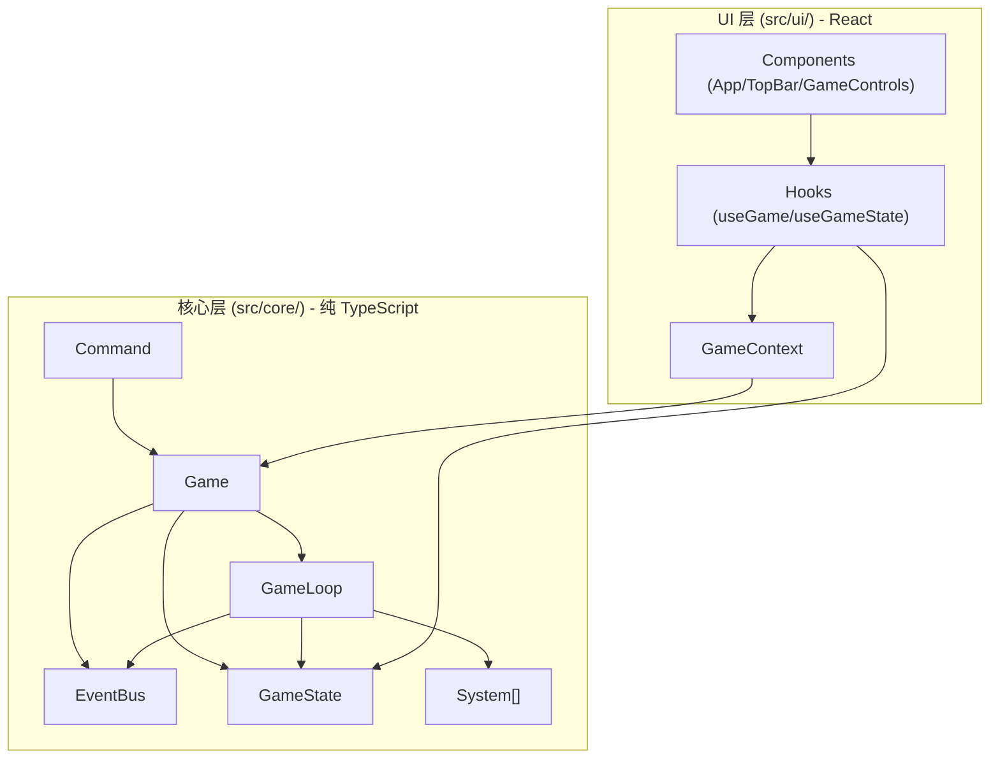

# AI 公司模拟经营游戏 - 技术架构文档

## 1. 架构设计



**架构原则**：
- 游戏逻辑与 UI 完全分离：`src/core/` 禁止 import React 或浏览器 DOM API（`requestAnimationFrame` 在 GameLoop 中需封装成可替换）
- 所有游戏状态集中管理，通过 immer 不可变更新
- UI 层仅通过 React Context 获取 Game 实例，通过自定义 Hook 订阅状态

## 2. 技术栈说明
- **前端框架**：React 18 + TypeScript（严格模式）
- **样式方案**：CSS Modules（不使用任何 UI 库）
- **构建工具**：Vite
- **状态更新**：immer（不可变状态更新）
- **路由**：不引入路由库，单页面应用

## 3. 目录结构

```
src/
├── core/
│   ├── Game.ts              # 主控制器
│   ├── GameState.ts         # 状态管理(immer)
│   ├── EventBus.ts          # 事件总线
│   ├── GameLoop.ts          # 主循环(rAF)
│   ├── interfaces/
│   │   ├── System.ts        # 系统接口
│   │   └── Command.ts       # 命令接口
│   └── utils.ts             # 工具函数
├── ui/
│   ├── context/
│   │   └── GameContext.tsx  # Context + Provider
│   ├── hooks/
│   │   ├── useGame.ts       # 获取 Game 实例
│   │   └── useGameState.ts  # 订阅状态选择器
│   ├── components/
│   │   ├── App.tsx          # 主组件
│   │   ├── TopBar.tsx       # 顶部状态栏
│   │   └── GameControls.tsx # 游戏控制栏
│   └── styles/
│       └── App.module.css   # 样式
├── main.tsx                 # 入口
└── vite-env.d.ts
```

## 4. 核心数据模型

```typescript
export interface GameData {
  date: number;               // 距起始日期的天数
  funds: number;              // 美元
  isPaused: boolean;          // 暂停状态
  speed: number;              // 游戏速度倍率
  computeCards: any[];        // 算力卡(占位)
  employees: any[];           // 员工(占位)
  models: any[];              // 模型(占位)
}
```

## 5. 核心类设计

### 5.1 EventBus
- 泛型事件总线，`Map<string, Set<Handler>>` 存储
- 方法：`on(event, handler)`, `off(event, handler)`, `emit(event, ...args)`

### 5.2 GameState
- 基于 immer `produce` 实现不可变更新
- 方法：`read()`, `update(recipe)`, `subscribe(listener)`, `resetData(data)`

### 5.3 GameLoop
- 使用 `requestAnimationFrame` 实现主循环（封装为可替换 raf 适配器）
- 每帧计算 deltaMs，按 speed 累积游戏天数
- 累积 >= 1 天时：发射 DAY_START → 遍历 systems.update → date+=1 → 发射 DAY_END
- 方法：`start()`, `stop()`, `setSpeed(s)`

### 5.4 Game 主控制器
- 持有 GameState / EventBus / GameLoop / systems
- 方法：`executeCommand(cmd)`, `start()`, `pause()`, `resume()`, `setSpeed(s)`, `save()`, `load(json)`

## 6. React 集成层

### 6.1 GameContext
- `React.createContext<Game | null>(null)`
- `GameProvider` 组件接收 game prop

### 6.2 Hooks
- `useGame()`：`useContext(GameContext)!`
- `useGameState(selector)`：基于 useState + useEffect 订阅 GameState

## 7. 验证标准
- `npm run dev` 启动后显示日期 0、资金 1,000,000
- 点击"开始"后日期每秒约 +1（speed=1）
- 点击暂停日期停止增加
- 调节速度影响日期变化快慢
